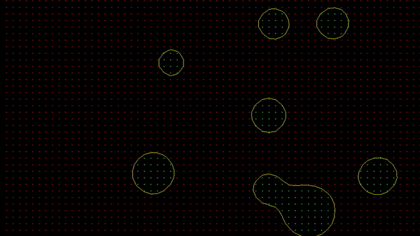
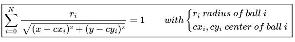
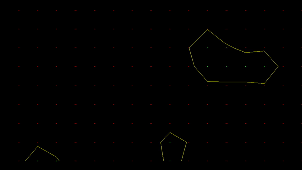
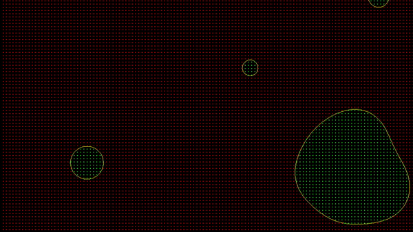

# Marching-square algorithm and metaballs

Draw *metaballs* using the *marching square algorithm* with glut.




### The Metaballs

Metaballs are objects with a center, a radius and a fixed velocity. They only move around

The implicit function to draw them 




does the work of reshaping the balls and meking them interact with each other. Each metaball basically behaves like charges in an electric field.


### The Marching Square Algorithm

We could draw the implicit function given by the formula above by checking each point of our window. It would be effective if we only want to draw metaballs but we're using a smarter algorithm

We first draw a grid on the window with a chosen distance between its dots

The grid is separated into red and green dots. The green dots represent the value on screen for which the implicit function is above the constant 1, the red dots are the points for which the function is inferior to the constant. 

For each green dot next to a red dot, we apply a linear interpolation between them to find a point for which the implicit function is correct. 

This way we only compute for value at the intersection of green and red dots.


You can play with the size of the grid. A higher distance between the dots of the grid will results in less computation but a poorer approximation of the function



A lower distance will make more computation but a better approximation





### Running 

You can use the make file to compile the project and execute it easily.

```make && ./marching_square```

 You will need glut to do so.
 
 You can draw your own function if you add them in the cpp file and put it into the argument of 

### Thanks

This short project has been made thanks to [Reducible](https://www.youtube.com/c/Reducible) on Youtube with [this video](https://www.youtube.com/watch?v=6oMZb3yP_H8).

This project is exactly what's described in the video. Check it if you want more details.


